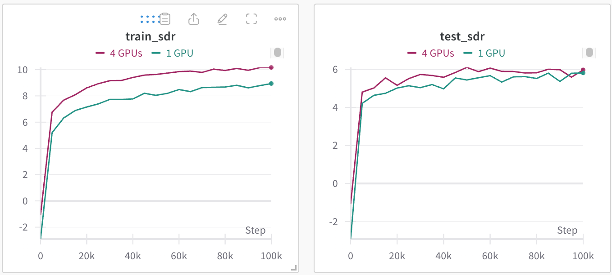

# A minimal Pytorch implementation of music source separation

This codebase provide a minimal Pytorch tutorial of music source separation. We use the [MUSDB18HQ](https://zenodo.org/records/3338373) dataset containing 100 training and 50 testing songs for training and validation, respectively.

## 0. Download datasets

Users need to download the dataset from https://zenodo.org/records/3338373. After download and unzip, the dataset looks like:

<pre>
dataset_root (30 GB)
	├── train (100 files)
	│   ├── A Classic Education - NightOwl
	│   │   ├── bass.wav
	│   │   ├── drums.wav
	│   │   ├── mixture.wav
	│   │   ├── other.wav
	│   │   └── vocals.wav
	│		... 
	│		└── ...
	└── test (50 files)
	    ├── Al James - Schoolboy Facination
	    │   ├── bass.wav
	    │   ├── drums.wav
	    │   ├── mixture.wav
	    │   ├── other.wav
	    │   └── vocals.wav
		 	... 
		 	└── ...
</pre>

## 1. Install dependencies

```bash
git clone https://github.com/qiuqiangkong/mini_mss

# Install Python environment
conda create --name mss python=3.8

conda activate mss

# Install Python packages dependencies.
sh env.sh
```

## 2. Single GPU training
```python
CUDA_VISIBLE_DEVICES=0 python train.py
```

## 3. Multiple GPUs training

We use Huggingface accelerate toolkit for multiple GPUs training. Here is an example of using 4 GPUs for training.

```python
CUDA_VISIBLE_DEVICES=0,1,2,3 accelerate launch --multi_gpu --num_processes 4 train_accelerate.py
```

The training takes around 20 min to train for 100,000 steps on a single RTX4090 GPU card. The result looks like:

<pre>
--- step: 0 ---                                                                           
Loss: 0.119                                                                                   
Train SDR: -0.504                                                                                    
Test SDR: -0.005                                                     
Save model to checkpoints/train/UNet/step=0.pth                                                     
Save model to checkpoints/train/UNet/latest.pth
...
--- step: 100000 ---
Evaluate on 10 songs.
Loss: 0.011
Train SDR: 8.942
Test SDR: 5.820
Save model to checkpoints/train/UNet/step=100000.pth
Save model to checkpoints/train/UNet/latest.pth
</pre>

The training and validation signal-to-distortion ratio (SDR) on 10 songs during training looks like:



## 4. Inference

Users may use the trained checkpoints for inference.

```python
CUDA_VISIBLE_DEVICES=0 python inference.py
```


## Reference
<pre>
@inproceedings{kong2021decoupling,
  title={Decoupling magnitude and phase estimation with deep resunet for music source separation},
  author={Kong, Qiuqiang and Cao, Yin and Liu, Haohe and Choi, Keunwoo and Wang, Yuxuan},
  booktitle={International Society for Music Information Retrieval (ISMIR)},
  year={2021}
}
</pre>